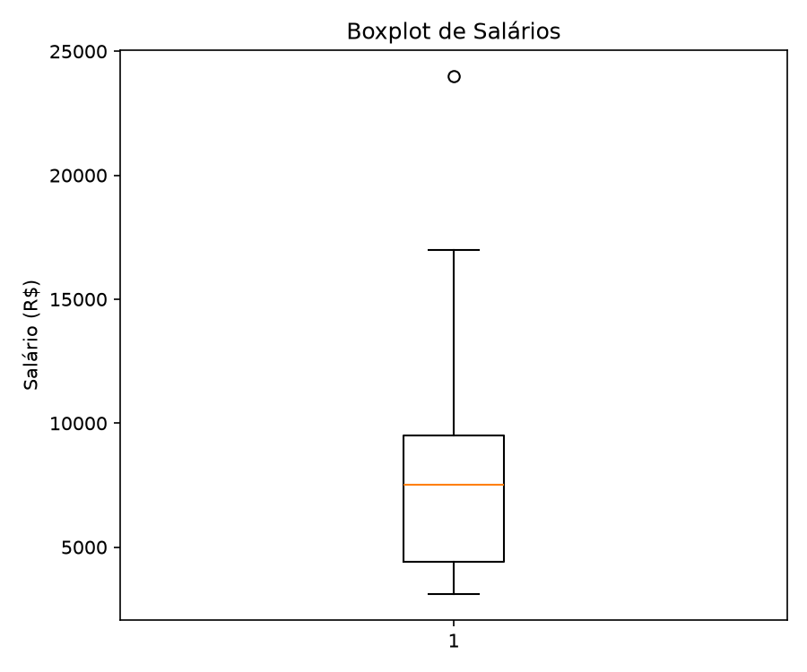
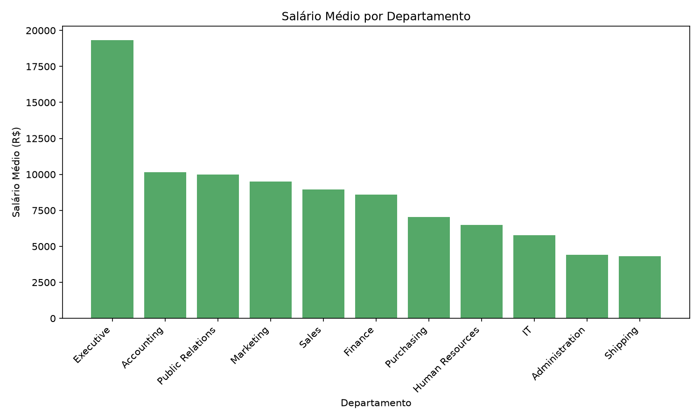
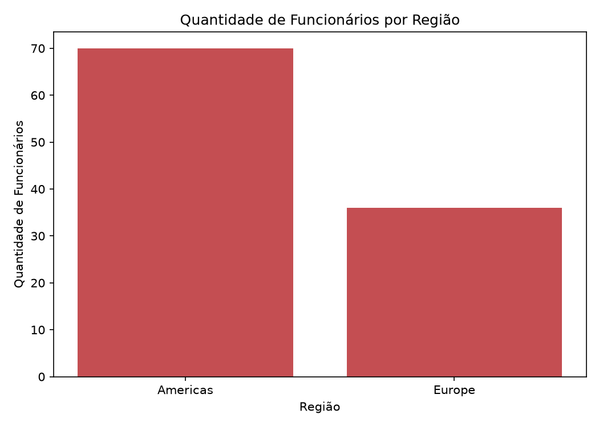
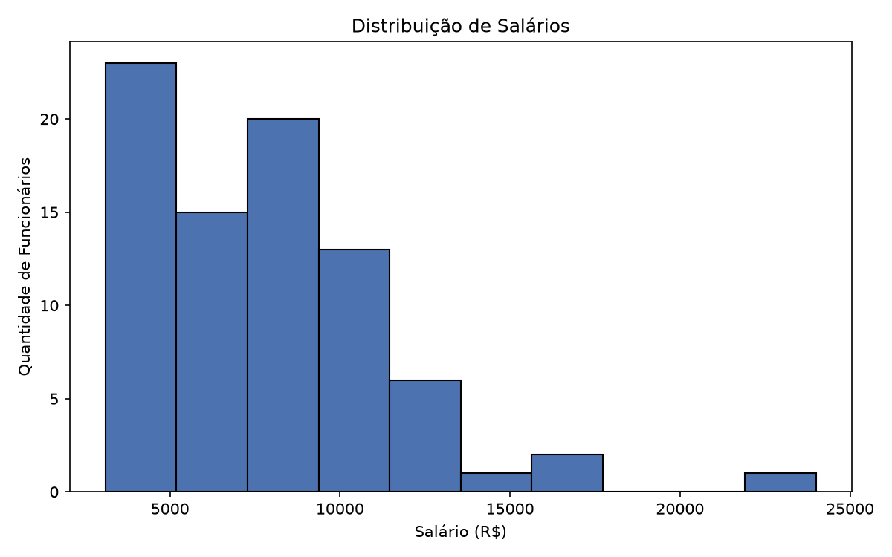

# Análise de Dados de RH — Salários e Distribuição Regional

**Aluna:** Aline P Santos
**Turma:** T3 — Módulo 1, Semana 13
**Curso:** SCTEC — Visualização de Dados e Business Intelligence

## Objetivo

Este projeto tem como objetivo atuar como analista de dados de RH, extraindo informações do banco de dados FreeSQL (schema HR) sobre salários, cargos, departamentos e localização dos funcionários, organizando esses dados e transformando-os em uma análise clara para apoiar decisões de negócio.

## Tabelas Utilizadas

Foram utilizadas as seguintes tabelas do schema **HR** (Human Resources):

- **EMPLOYEES**: dados dos funcionários (nome, salário, cargo, departamento)
- **DEPARTMENTS**: nome de cada departamento da empresa
- **JOBS**: título de cada cargo
- **LOCATIONS**: cidade e estado de cada unidade da empresa
- **COUNTRIES**: país de cada localização
- **REGIONS**: região geográfica de cada país

## Consultas SQL

### query_1.sql — Salário por Departamento e Cargo
Une a tabela de funcionários com departamento e cargo usando `LEFT JOIN`, para manter na análise até mesmo funcionários sem departamento cadastrado. Filtra apenas salários acima de R$ 3.000.

### query_2.sql — Funcionários por Região
Une funcionários → departamento → localização → país → região, também com `LEFT JOIN`, filtrando apenas registros com região identificada. Mostra onde a empresa tem mais funcionários.

## Análise em Python

A análise foi feita com **Pandas**, **Matplotlib** e **Seaborn** em um Jupyter Notebook (`analysis/eda_salarios_rh.ipynb`), seguindo estas etapas:

1. Importação dos dois arquivos CSV
2. Verificação da estrutura dos dados (`.info()`, `.shape`)
3. Verificação de valores nulos e duplicados
4. Cálculo de estatísticas descritivas (média, mediana, mínimo, máximo, desvio padrão)
5. Geração de gráficos (histograma, boxplot e gráficos de barras)

## Principais Resultados (Insights)

**1. Os salários mais altos "puxam a média pra cima"**
Alguns cargos ganham muito mais que a maioria (o presidente ganha R$ 24.000), o que faz a média parecer mais alta do que o salário que a maioria realmente recebe.



**2. Uns departamentos pagam bem mais que outros**
O departamento Executivo paga em média R$ 19.333 — mais que o dobro do segundo colocado (Contabilidade, R$ 10.154) e mais de 4 vezes o departamento que paga menos (Expedição, R$ 4.313).



**3. A maioria dos funcionários está nas Américas**
70 de 106 funcionários (mais de 6 em cada 10) estão na região das Américas, e apenas 36 na Europa.



**4. Os dados estão quase todos completos**
Apenas 1 funcionário sem departamento cadastrado e 1 sem estado/província — menos de 2% de dados faltando, o que indica boa qualidade da base.



### Estatísticas Descritivas dos Salários

| Métrica | Valor |
|---|---|
| Média | R$ 7.696,49 |
| Mediana | R$ 7.500,00 |
| Mínimo | R$ 3.100,00 |
| Máximo | R$ 24.000,00 |
| Desvio Padrão | R$ 3.725,87 |

## Como Executar

### Pré-requisitos
- Python 3.10 ou superior
- Acesso ao banco FreeSQL (schema HR): https://freesql.com/

### Instalação
```bash
python3 -m venv venv
source venv/bin/activate
pip install -r requirements.txt
```

### Execução
1. Abra `analysis/eda_salarios_rh.ipynb` no Jupyter/VS Code
2. Selecione o kernel `venv`
3. Execute todas as células em ordem ("Run All")

## Sugestões de Melhoria

- Incluir análise de tempo médio na empresa (usando a tabela `JOB_HISTORY`)
- Adicionar dashboard interativo (ex: Power BI ou Streamlit)
- Analisar a evolução salarial ao longo do tempo, não só o estado atual

## Vídeo de Apresentação

🎥 [Link do vídeo será adicionado aqui]
